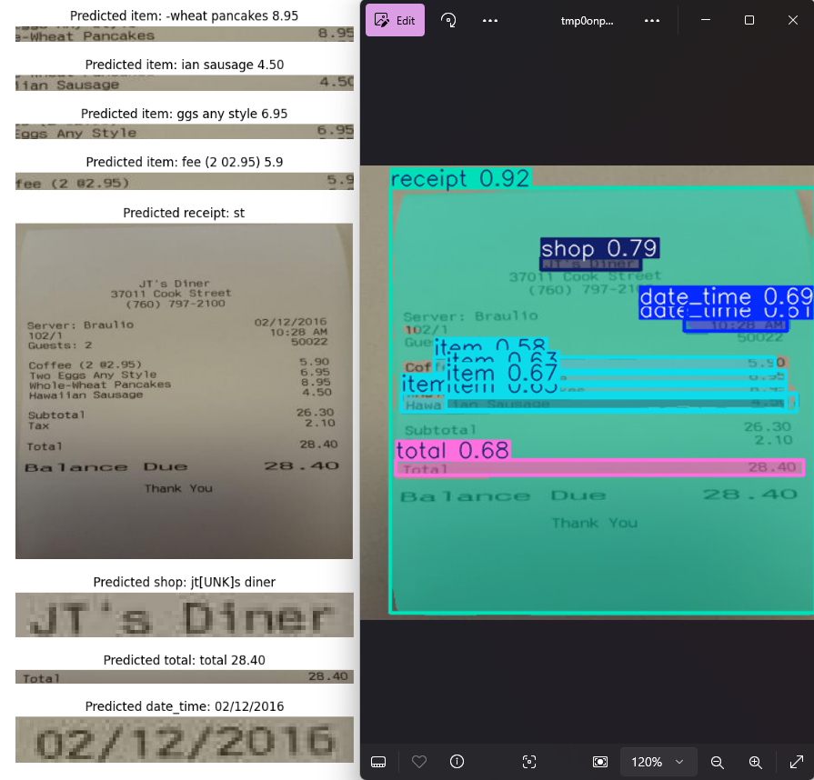

<a id="renote-top"></a>


<!-- PROJECT LOGO -->
<br />
<div align="center">
  <a href="https://github.com/PiggyBank-BangkitCapstoneTeam/ReNote">
    
  </a>

  <h3 align="center">ReNote</h3>

  <p align="center">
    Empowering Gen Z to take control of their finances, one receipt at a time.
    <br />
  </p>
</div>

<!-- ABOUT THE PROJECT -->
## 🔍 About The Project

ReNote is a personal finance application designed to simplify expense tracking and promote healthy spending habits through the scanning and analysis of shopping and food receipts. Its key features include the Split Bill, Monthly Spending Tracker, and Expense Categorization Tool, aimed at helping users better understand and manage their finances.

* Split Bill Feature: This feature allows users to quickly and accurately divide expenses for shared shopping or dining experiences, reducing confusion and enhancing transparency in joint expenditures.
* Monthly Spending Tracker: This feature enables users to monitor their cumulative monthly expenditures, ensuring adherence to budget goals and increasing financial awareness.
* Expense Categorization Tool: This tool automatically categorizes expenses extracted from receipts into predefined categories, such as dining, groceries, entertainment, and transportation. This allows users to see where their money is going, helping them make better budgeting decisions.

ReNote functions not just as an expense tracker but also as an educational platform that enhances financial literacy among Gen Z, who often shop impulsively. By utilizing scanning and analytical technologies, ReNote aims to help users achieve better financial planning and live in alignment with their financial needs and goals.


<p align="right">(<a href="#renote-top">back to top</a>)</p>


### 🛠️ Built With
* [![Visual Studio Code][VSCode]][VSCode-url]
* [![Python][Python]][Python-url]
* [![TensorFlow][TensorFlow]][TensorFlow-url]
* [![Keras][Keras]][Keras-url]
* [![OpenCV][OpenCV]][OpenCV-url]
* [![YOLO][YOLO]][YOLO-url]
* [![Conda][Conda]][Conda-url]
* [![Anaconda][Anaconda]][Anaconda-url]

<p align="right">(<a href="#renote-top">back to top</a>)</p>


<!-- GETTING STARTED -->
## 🌟 Getting Started

This guide provides instructions on how to set up your Receipt Text Recognizer Model project locally. Follow these steps to get started.

### ⚙️ Prerequisites

Before setting up the project, ensure you have the following installed on your system:

* **Python 3.11 or lower**: [Download Python](https://www.python.org/downloads/)
* **Conda (Anaconda/Miniconda)**: [Download Conda](https://docs.conda.io/en/latest/miniconda.html)
* **Git**: [Download Git](https://git-scm.com/downloads)
* **Pre-Train Model**: [Download Pre-Train Model](https://drive.google.com/drive/folders/1gLAUvi3ZRD5bvERJO5ZjPGWa4AiHaQSD?usp=sharing)

### 💻 Installation

Follow these steps to clone the repository and set up the environment:

1. **Clone the repository**
   ```sh
   git clone https://github.com/Grego003/Receipt_Text_Recognizer_Model.git
   ```

2. **Navigate to the project directory**
   ```sh
   cd Receipt_Text_Recognizer_Model
   ```

3. **Set up a virtual environment**
   You can choose one of the following methods to set up the environment:

   **Using Conda:**
   ```sh
   conda create --name receipt_recognizer_env python=3.8
   conda activate receipt_recognizer_env
   ```

   **Using Pipenv:**
   If you do not wish to use Conda, you can use Pipenv to manage the virtual environment:
   ```sh
   pip install pipenv
   pipenv install
   pipenv shell
   ```

4. **Install the required Python packages**
   Run the following command to install dependencies listed in `requirements.txt`:
   ```sh
   pip install -r requirements.txt
   ```

5. **Verify installation**
   Test the setup by running the example script (if available) or by running the model pipeline:
   ```sh
   python your_script_name.py
   ```

### 📝 Notes

- Ensure your IDE, such as VSCode, is configured to use the virtual environment (`receipt_recognizer_env` for Conda or the Pipenv shell environment).
---

<p align="right">(<a href="#renote-top">back to top</a>)</p>


<!-- USAGE EXAMPLES -->
## 📸 Preview

<div align="center">
  
</div>

<p align="right">(<a href="#renote-top">back to top</a>)</p>


<!-- Main Quest -->
## 🏆 Main Quest

✔️ Utilize TensorFlow architecture for building machine learning models.


<p align="right">(<a href="#renote-top">back to top</a>)</p>

<!-- Contributors -->
### 🙏 Contributors

<a href="https://github.com/Grego003/Receipt_Text_Recognizer_Model/graphs/contributors">
  
</a>

<p align="right">(<a href="#renote-top">back to top</a>)</p>


<!-- CONTACT -->
## 📱 Contact 

* Agustinus : [Linkedin](https://www.linkedin.com/in/agustinus-tech)
* Renfred Leeman : [Linkedin](https://www.linkedin.com/in/renfred-leeman)
* Gregorius Ivan Halim: [Linkedin](https://www.linkedin.com/in/gregorius-ivan-halim-58365421a/)
* ReNote Machine learning Team : [Github](https://github.com/Grego003/Receipt_Text_Recognizer_Model)

<p align="right">(<a href="#renote-top">back to top</a>)</p>


[VSCode]: https://img.shields.io/badge/Visual%20Studio%20Code-007ACC?style=for-the-badge&logo=visualstudiocode&logoColor=white
[VSCode-url]: https://code.visualstudio.com/
[Python]: https://img.shields.io/badge/Python-3776AB?style=for-the-badge&logo=python&logoColor=white
[Python-url]: https://www.python.org/
[TensorFlow]: https://img.shields.io/badge/TensorFlow-FF6F20?style=for-the-badge&logo=tensorflow&logoColor=white
[TensorFlow-url]: https://www.tensorflow.org/
[Keras]: https://img.shields.io/badge/Keras-D00000?style=for-the-badge&logo=keras&logoColor=white
[Keras-url]: https://keras.io/
[OpenCV]: https://img.shields.io/badge/OpenCV-5C3EE8?style=for-the-badge&logo=opencv&logoColor=white
[OpenCV-url]: https://opencv.org/
[YOLO]: https://img.shields.io/badge/YOLO-2B2B2B?style=for-the-badge&logo=yolo&logoColor=white
[YOLO-url]: https://pjreddie.com/darknet/yolo/
[Conda]: https://img.shields.io/badge/Conda-44A833?style=for-the-badge&logo=anaconda&logoColor=white
[Conda-url]: https://conda.io/
[Anaconda]: https://img.shields.io/badge/Anaconda-44A833?style=for-the-badge&logo=anaconda&logoColor=white
[Anaconda-url]: https://www.anaconda.com/